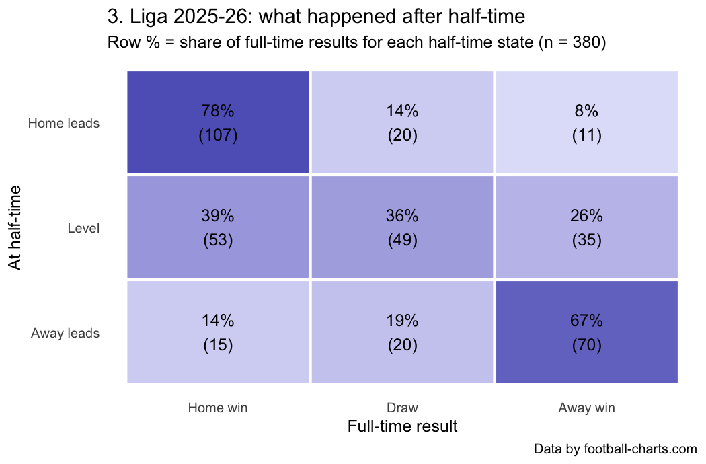

# Half-time/full-time heatmap in R

`ht_ft_heatmap.R` loads all 380 matches of Germany's 3. Liga 2025-26 from the free [Football Charts API](https://www.football-charts.com/developers), parses the scores, checks the data and draws a half-time/full-time heatmap with ggplot2.

Walk-through: **https://www.football-charts.com/insights/ht-ft-heatmap-r**

```r
install.packages(c("jsonlite", "dplyr", "tidyr", "ggplot2"))
source("ht_ft_heatmap.R")   # writes ht_ft_heatmap_3liga_2025-26.png
```

No key needed for the current and previous season. Tested with R 4.6.1, jsonlite 2.0.0, dplyr 1.2.1, ggplot2 4.0.3.



Data by football-charts.com.
